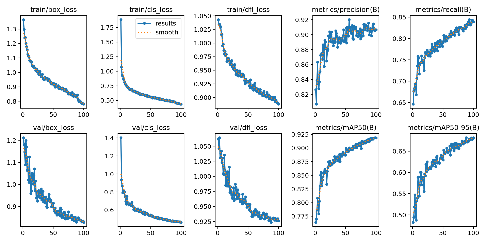
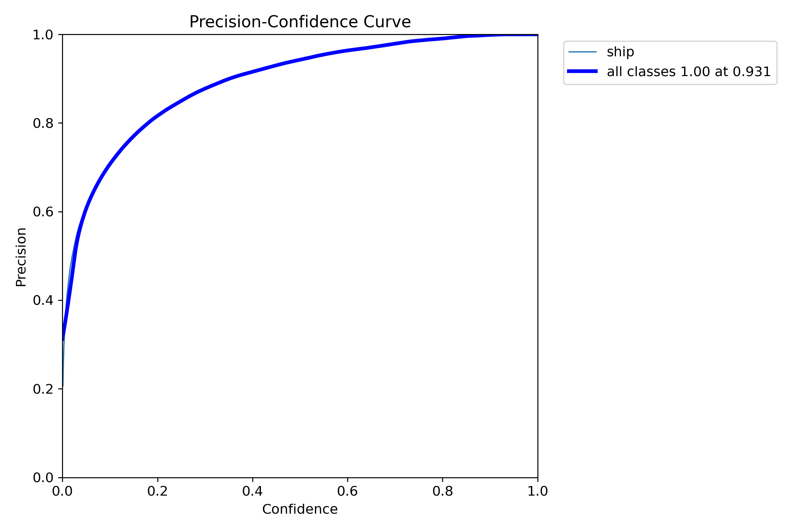
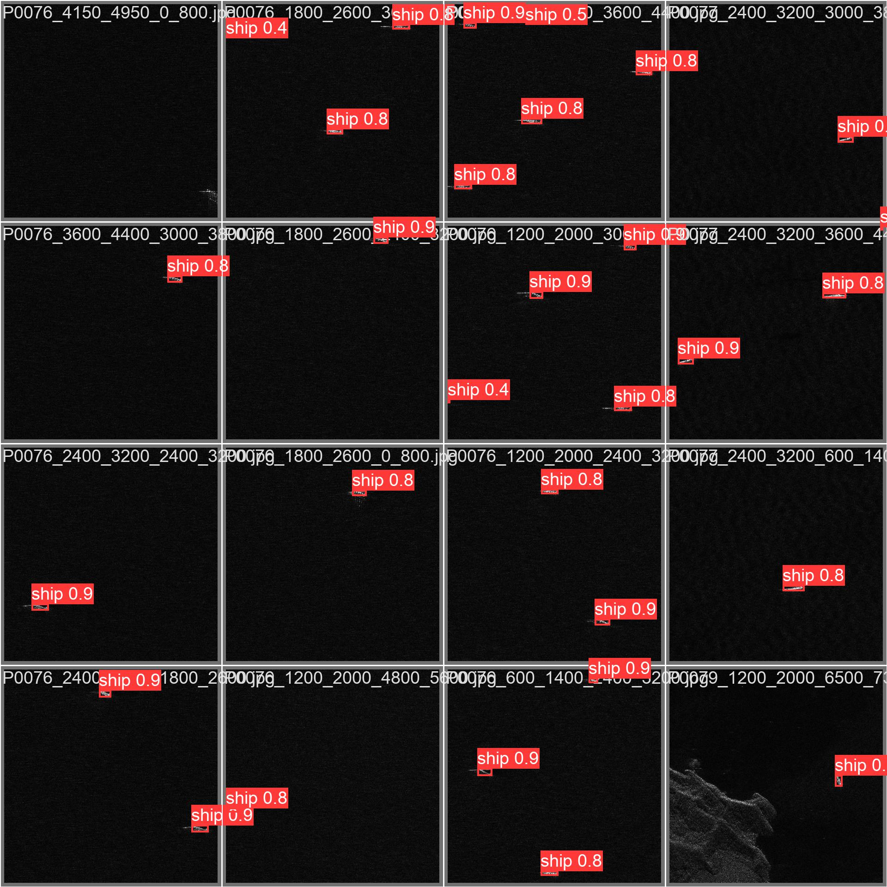
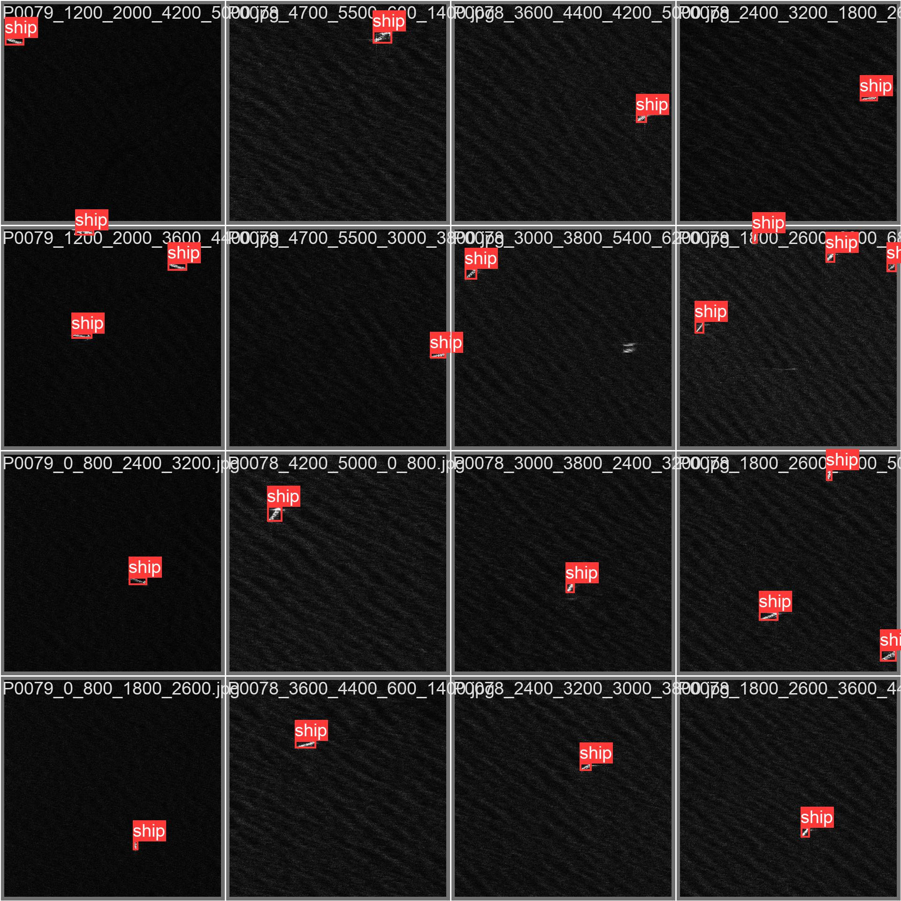
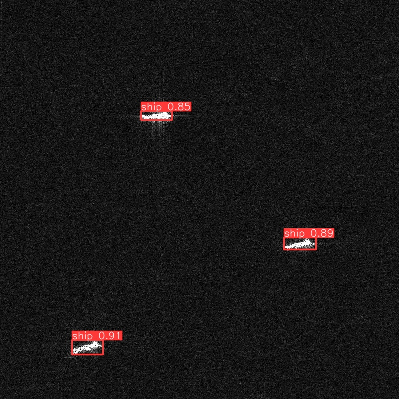
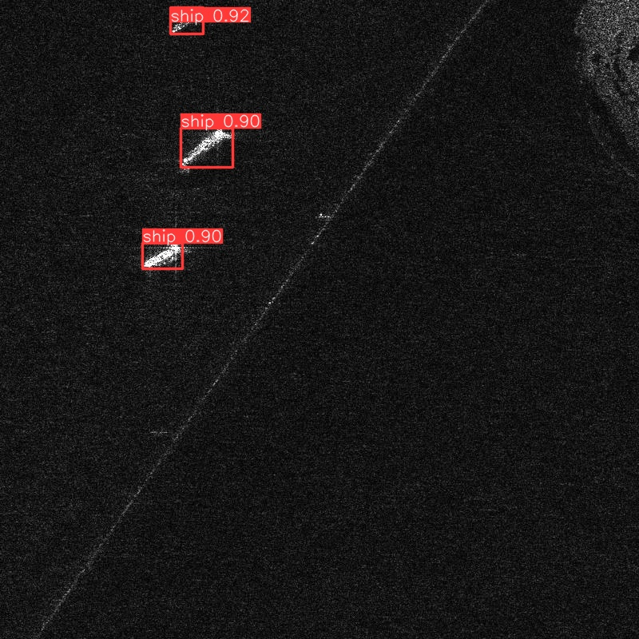
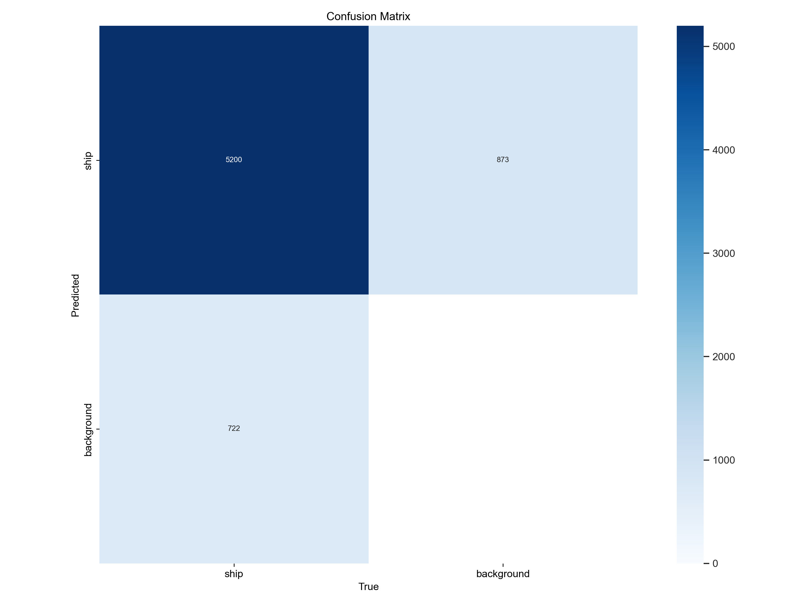
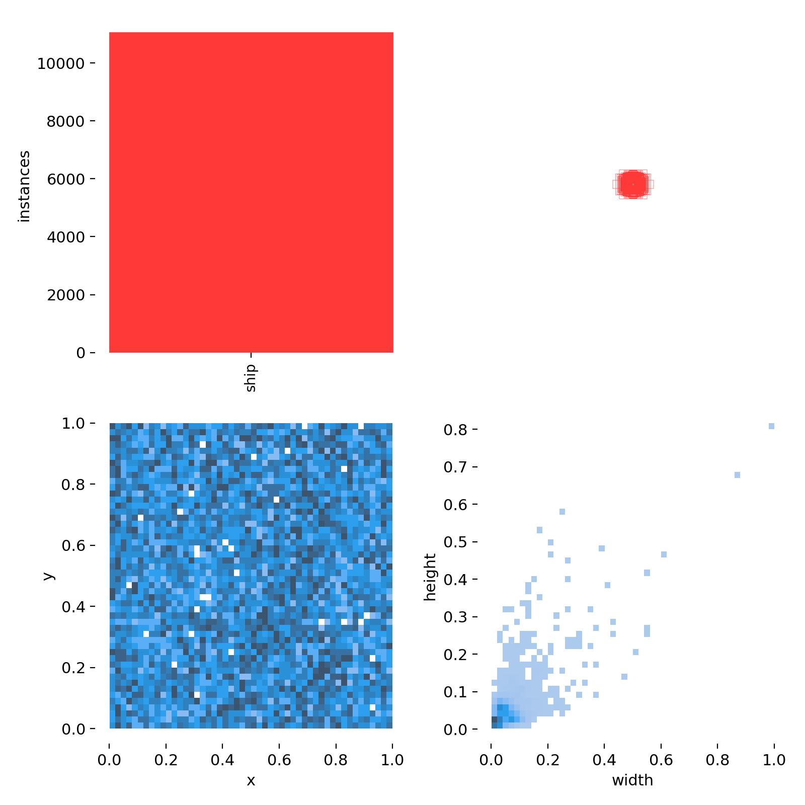

# SAR Ship Detection

## Introduction
This repository contains the implementation of ship detection using the YOLOv8 model. The primary focus is on detecting ships in SAR (Synthetic Aperture Radar) images. The dataset used for training and testing consists of SAR images along with their corresponding annotations.

## Dataset
The dataset is structured as follows:
- **dataset/HRSID_jpg**: This folder contains the dataset comprising 5604 images along with their annotations.

## Model
The ship detection model is based on YOLOv8 architecture. The model has been trained using the provided dataset to detect ships in SAR images. The trained model's results are stored in the following directory:

- **runs/detect_model**: This folder contains the results obtained by running the YOLOv8 model on the dataset.

## Results

| Metric                      | Result  |
|-----------------------------|---------|
| Precision                   | 0.8932  |
| Recall                      | 0.7872  |
| Mean Average Precision (mAP)| 0.8830  |

### Images

<table style="text-align:center;">
  <tr>
    <td><b style="text-align:left;">Results</b> </td>
    <td><b style="text-align:left;">Precision Curve</b> </td>
  </tr>
  <tr>
    <td><b style="text-align:left;">Training Sample 1</b> </td>
    <td><b style="text-align:left;">Training Sample 2</b> </td>
  </tr>
  <tr>
    <td><b style="text-align:left;">Validating Sample 1</b> </td>
    <td><b style="text-align:left;">Validating Sample 2</b> </td>
  </tr>
  <tr>
    <td><b style="text-align:left;">Confusion Matrix</b> </td>
    <td><b style="text-align:left;">Labels Matrix</b> </td>
  </tr>
</table>

## Usage
1. **Testing**: To test the model on new samples, place the images along with their labels in the `test` folder.
2. **Training**: For training the model, use the images and labels provided in the `train` folder. Additionally, two Jupyter notebooks are provided for bounding box visualization and model training. These notebooks can be found in the root directory.

## Notebooks
- **bounding_box.ipynb**: This notebook provides visualization of bounding boxes on sample images.
- **train_model.ipynb**: This notebook details the steps involved in training the YOLOv8 model on the SAR ship detection dataset.

## Requirements
Ensure you have the following dependencies installed:
- Python >= 3.6
- PyTorch
- OpenCV
- NumPy
- Matplotlib

